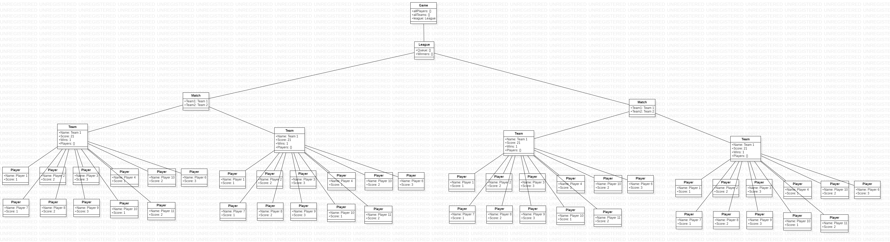
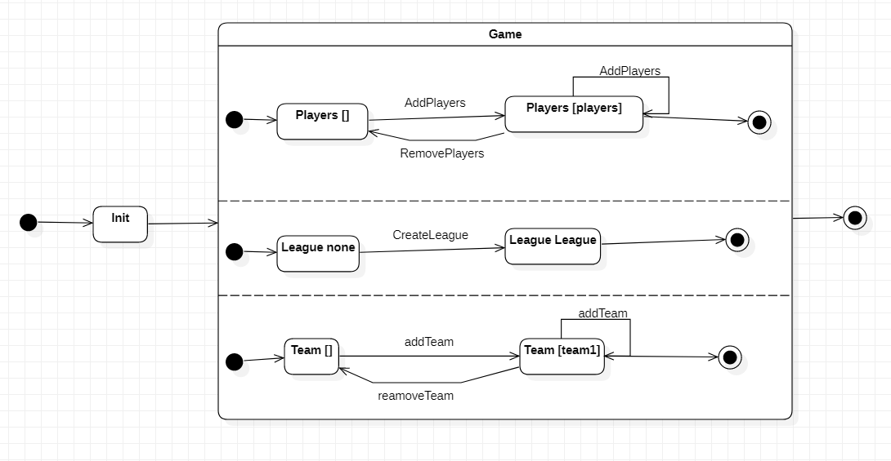

# Assignment 3

Maximum number of words for this document: 18000

**IMPORTANT**: In this assignment you will fully model and impement your system. The idea is that you improve your UML models and Java implementation by (i) applying (a subset of) the studied design patterns and (ii) adding any relevant implementation-specific details (e.g., classes with “technical purposes” which are not part of the domain of the system). The goal here is to improve the system in terms of maintainability, readability, evolvability, etc.    

**Format**: establish formatting conventions when describing your models in this document. For example, you style the name of each class in bold, whereas the attributes, operations, and associations as underlined text, objects are in italic, etc.

### Summary of changes of Assignment 2
Author(s): `name of the team member(s) responsible for this section`

Provide a bullet list summarizing all the changes you performed in Assignment 2 for addressing our feedback.

Maximum number of words for this section: 1000

### Application of design patterns
Author(s): `name of the team member(s) responsible for this section`

`Figure representing the UML class diagram in which all the applied design patterns are highlighted graphically (for example with a red rectangle/circle with a reference to the ID of the applied design pattern`

| ID  | DP1  |  
|---|---|  
| **Design pattern** | Singleton |  
| **Problem** | The **Game** class controls access to shared objects such as the team and player lists. Other classes including the GUI call the **Game** class to access these resources, such that it is necessary that there exists only one instance in order to maintain consistency. |  
| **Solution** | By making **Game** a singleton class, we ensure the other classes calling it are accesing the same object and information is consistent across the system, e.g. every class has access to the same list of teams. |  
| **Intended use** | Classes accessing information inside **Game** are doing so via an unique **GAME_INSTANCE**.  |  
| **Constraints** | N/A |  

| ID  | DP2  |  
|---|---|  
| **Design pattern** | Singleton |  
| **Problem** | Managing scene switching in JavaFX|  
| **Solution** | We created a **SceneManager** to address the switching between the 4 different panes we display as part of our GUI. We need a unique instance of this class as every pane is initalized within it. |  
| **Intended use** | Whenever a different pane must be loaded, the system calls the **SceneManager** instance rather than loading a pane directly.  |  
| **Constraints** | N/A |  

| ID  | DP3  |  
|---|---|  
| **Design pattern** |  |  
| **Problem** | |  
| **Solution** | |  
| **Intended use** |  |  
| **Constraints** |  |  

## Class diagram									
Author(s): `name of the team member(s) responsible for this section`

This chapter contains the specification of the UML class diagram of your system, together with a textual description of all its elements.

`Figure representing the UML class diagram`

For each class (and data type) in the class diagram you have to provide a paragraph providing the following information:
- Brief description about what it represents
- Brief description of the meaning of each attribute
- Brief description of the meaning of each operation
- Brief description of the meaning of each association involving it (each association can be described only once in this deliverable)

Also, you can briefly discuss fragments of previous versions of the class diagram (with figures) in order to show how you evolved from initial versions of the class diagram to the final one.

In this document you have to adhere to the following formatting conventions:
- the name of each **class** is in bold
- the *attributes*, *operations*, *associations*, and *objects* are in italic.

Maximum number of words for this section: 4000

## Object diagrams								
Author(s): `Torstein Thomassen`

This chapter contains the description of a "snapshot" of the status of your system during its execution. 
This chapter is composed of a UML object diagram of your system, together with a textual description of its key elements.

`Figure representing the UML class diagram`
  

`Textual description`

Maximum number of words for this section: 1000

## State machine diagrams									
Author(s): `Torstein Thomassen` & `Teona Moga`

The state diagrams of the **Game** and **League** classes are shown below.

`State diagram over League Class`

The state diagram above represents the different states a league can be in. When it is initialized, no rounds are played so the *winners* map is empty; the *initialTeams* attribute represents the league schedule and *leagueId* represents an unique id for the given league, both are instantiated in the constructor to the parameters passed by the **Game** class. **League** has one recursive method, called when the results of the created schedule, i.e. *initialTeams*, are requested. What breaks the recursion is having no more matches to play in a subsequent round, as there is only one team left (the winner of the league).

`State diagram over Game Class`

The state diagram above represents the state a Game can be in. 

## Sequence diagrams									
Author(s): `name of the team member(s) responsible for this section`

This chapter contains the specification of at least 2 UML sequence diagrams of your system, together with a textual description of all its elements. Here you have to focus on specific situations you want to describe. For example, you can describe the interaction of player when performing a key part of the videogame, during a typical execution scenario, in a special case that may happen (e.g., an error situation), when finalizing a fantasy soccer game, etc.

For each sequence diagram you have to provide:
- a title representing the specific situation you want to describe;
- a figure representing the sequence diagram;
- a textual description of all its elements in a narrative manner (you do not need to structure your description into tables in this case). We expect a detailed description of all the interaction partners, their exchanged messages, and the fragments of interaction where they are involved. For each sequence diagram we expect a description of about 300-500 words.

The goal of your sequence diagrams is both descriptive and prescriptive, so put the needed level of detail here, finding the right trade-off between understandability of the models and their precision.

Maximum number of words for this section: 4000

`Sequence diagram showing League creation and execution`

This sequence diagrams shows the interactions between the player and the game to execute the league from a player provided schedule. This sequence happens when all teams have been made and the player starts the league simulation. 
The player represented by the actor element provides a schedule with all the matches that will play in the first round to the game. 

From this schedule a new League object is created. The league then starts with the playRound function. Here all the scheduled matches are played one by one in the Loop fragment. A match object is created and returns the winner of the match before being destroyed. The winning teams are added to the pool of teams playing next round. 

Once a round is over, the Alt fragment checks if there are more than one remaining team. If yes playRound is called recursively, as shown by the self-call element. The exit condition is one team remaining, and when it is met the results are sent to the game and the league object is destroyed.

## Implementation									
Author(s): `name of the team member(s) responsible for this section`

In this chapter you will describe the following aspects of your project:
- the strategy that you followed when moving from the UML models to the implementation code;
- the key solutions that you applied when implementing your system (for example, how you implemented the syntax highlighting feature of your code snippet manager, how you manage fantasy soccer matches, etc.);
- the location of the main Java class needed for executing your system in your source code;
- the location of the Jar file for directly executing your system;
- the 30-seconds video showing the execution of your system (you can embed the video directly in your md file on GitHub).

IMPORTANT: remember that your implementation must be consistent with your UML models. Also, your implementation must run without the need from any other external software or tool. Failing to meet this requirement means 0 points for the implementation part of your project.

Maximum number of words for this section: 2000

## References

References, if needed.
