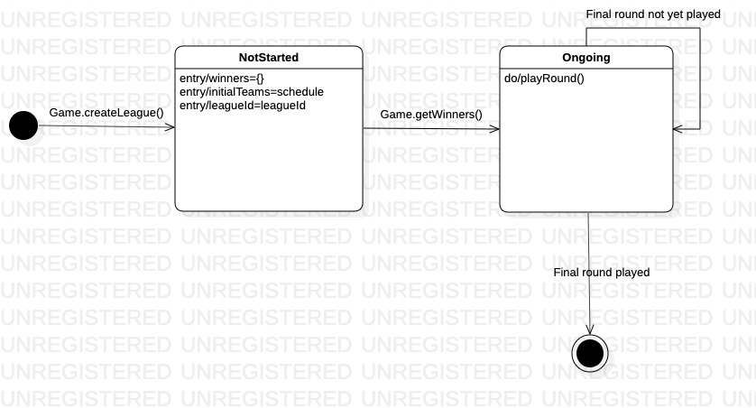

# Assignment 3

Maximum number of words for this document: 18000

**IMPORTANT**: In this assignment you will fully model and impement your system. The idea is that you improve your UML models and Java implementation by (i) applying (a subset of) the studied design patterns and (ii) adding any relevant implementation-specific details (e.g., classes with “technical purposes” which are not part of the domain of the system). The goal here is to improve the system in terms of maintainability, readability, evolvability, etc.    

**Format**: establish formatting conventions when describing your models in this document. For example, you style the name of each class in bold, whereas the attributes, operations, and associations as underlined text, objects are in italic, etc.

### Summary of changes of Assignment 2
Author(s): `Torstein Thomassen`

Bullet list summarizing all the changes from Assignment 2 feedback:

- Changed object diagram, to represent the whole system, and not just parts of it.
- Grammar changes and better names inside diagrams and implementation. (e.g not A, B or temp)
- Better and more detailed diagrams. 
- Continuity of coding style.
 
 

### Application of design patterns
Author(s): `name of the team member(s) responsible for this section`

`Figure representing the UML class diagram in which all the applied design patterns are highlighted graphically (for example with a red rectangle/circle with a reference to the ID of the applied design pattern`

| ID  | DP1  |  
|---|---|  
| **Design pattern** | Singleton |  
| **Problem** | The **Game** class controls access to shared objects such as the team and player lists. Other classes including the GUI call the **Game** class to access these resources, such that it is necessary that there exists only one instance in order to maintain consistency. |  
| **Solution** | By making **Game** a singleton class, we ensure the other classes calling it are accesing the same object and information is consistent across the system, e.g. every class has access to the same list of teams. |  
| **Intended use** | Classes accessing information inside **Game** are doing so via an unique **GAME_INSTANCE**.  |  
| **Constraints** | N/A |  

| ID  | DP2  |  
|---|---|  
| **Design pattern** | Singleton |  
| **Problem** | Managing scene switching in JavaFX|  
| **Solution** | We created a **SceneManager** to address the switching between the 4 different panes we display as part of our GUI. We need a unique instance of this class as every pane is initalized within it. |  
| **Intended use** | Whenever a different pane must be loaded, the system calls the **SceneManager** instance rather than loading a pane directly.  |  
| **Constraints** | N/A |  

| ID  | DP3  |  
|---|---|  
| **Design pattern** | Lightweight  |  
| **Problem** | Creating many object takes up a lot of memory, and makes extra computing |  
| **Solution** | Creating all the object with shared properties referring to the same place in memory.  |  
| **Intended use** | All Player object with the same data (score attribute) share the same memory (RAM). This reduce the number of *Player* object created. |  
| **Constraints** | N/A |  

## Class diagram									

Author(s): `Teona Moga`  
  
  
  
The system we designed for the Fantasy Soccer project consists of 3 packages: *models*, *views* and *controllers* and one Main class. Packages *views* and *controllers* deal with the GUI part of the project and are implemented using the javafx library, such that they will be described more briefly than *models*, which is where the entire back-end logic lies.     
### *Models* package    
 This package implements 7 distinct classes: **Game**, **League**, **Team**, **Player**, **PlayerType**, **PlayerFactory** and **Match**, described below.    
    
#### **Game**    
 This class is responsible with managing the data of the game and coordinating actions across the system.  
    
Attributes   
    
- *allPlayers* (type: ArrayList<Player&gt;): list of all user-added players    
- *allTeams* (type: ArrayList<Team&gt;): list of all user-created teams    
- *leagues* (type: ArrayList<League&gt;): user-created leagues; current implementation only deals with one league, but this would help the code better accommodate changes and addition to leagues in the case of future extensions
    
Operations  
    
- *void addPlayers(String pathToFile)* : method for adding new players to the *allPlayers* arraylist; parameter specifies the path to the CSV file, as per **FR1**    
- *ArrayList<String&gt; getAllPlayersNames()* : returns all exiting players' names
- *ArrayList<Player&gt;  getAllPlayers()* : returns *allPlayers*
-  *Player getPlayerByName(String name)* : returns the **Player** object with the given *name*

 - *void addTeam(Player[] players, String teamName)*: method for adding a team to the *allTeams* arraylist; parameters are the same as the ones required by the **Team** constructor.    
    
- *void createLeague(Queue<Team&gt; schedule)*: method for defining the league to be played; parameter is a list of teams ordered by their playing order, e.g.  a round with matches (Team1 vs. Team2) and (Team3 vs. Team4) would be represented as {Team1, Team2, Team3, Team4}.  
- *HashMap<Integer, ArrayList<Team&gt;> getLeagueResults()*: returns the winners of *league* in the original format of the **League** class (described below)  
- *ArrayList<Team&gt; generateLeaderboard()*: returns a sublist of first 10 teams in *allTeams* sorted by their number of wins (**Team**.wins)  
- *ArrayList<String&gt; getAllTeamNames()*: returns the team names of teams in *allTeams*  
- *Team getTeamByName(String name)*: returns the team from *allTeams* with the given *name*  

  
Associations  
  
As can be observered from the class diagram, the **Game** class has composition relations with **Team**, **Player** and **League**, as it is resposible with creating and storing these other objects. While it can store an indefinite number of teams and players, a game can only have one league, as a user can not play multiple leagues at one time.  It also has associations with the GUI classes, which intercat with **Game** to either follow up on user actions, e.g. forming a new team, or get the data to be displayed to the user, e.g. the leaderboard.  
  
#### **Player**  
  
Class representing a single player. Only exists within a **Game** and is created from user input.  
  
Attributes   
  
- *name* (type: String): player's name  
- *type* (type: PlayerType): player's type 
  
Operations  
  
- *String getName()*: returns *name*  
- *int getType()* : returns *type*  
  
Associations  
  
All **Player** objects are contained within **Game**. A team is an aggregation of exactly 11 **Player** objects.  

#### **PlayerType**  

Basic class necessary for the implementation of the Flyweight design pattern, described in the previous section. Could potentially be extended to have multiple attributes.

  Attributes   
  
- *score* (type: int): player's score
  
Operations  

- *int getScore()* : returns *score*  
  
  
 Associations

A **PlayerFactory** is an aggregation of  mupltiple **PlayerTypes** objects. 

#### **PlayerFactory**

Class implementing the Flyweight design pattern.   

  Attributes   
  
- *playerTypes* (type: Map<String, PlayerType>): player types
  
Operations  

- *PlayerType getPlayerType(String name, int score)* : returns corensponding **PlayerType**
  
#### **Team**  
  
Class representing a single soccer team. Only exists within a **Game** and is created through the GUI by the user through the selection of 11 **Player** objects.  
  
Attributes   
  
- *players* (type: Player[]): all the players in a team. Represented by an array as a team has exactly 11 players.  
- *score* (type: int): team's total score  
- *wins* (type: int): team's total number of wins in leagues played by the user; initilized to 0  
- *teamName* (type: String): team name, unique attribute used to identify a team  
  
Operations   
  
- *int calculateScore()*: calculates the *score* of a team by adding up all the *players* objects individual scores  
-  *int getTeamScore()*: returns *score*  
-  *int getTotalWins()*: returns *wins*  
- *String getTeamName()*: returns *teamName*  
- *void addNewWin()*: increments *wins*  
- *void setPlayers(Player[] players)*: updates *players*; used when the user makes changes to their team
  
Associations  
  
The composition relation between **Team** and **Game** suggests the fact that all **Team** objects ever created are part of the **Game**.allTeams.   
Each team is an aggregation of exactly 11 **Player** objects.    
  
#### **League**   
A league simulates multiple rounds of matches between user-selected teams and determines the winners.  
  
Attributes  
  
- *initialTeams* (type:Queue<Team&gt;): List of the teams playing in the first round, as selected by the user.  Already described in **Game**.createLeague's parameter as: list of teams ordered by their playing order, e.g.  a round with matches (Team1 vs. Team2) and (Team3 vs. Team4) would be represented as {Team1, Team2, Team3, Team4}  
-  *winners* (type: HashMap<Integer, ArrayList<Team&gt;>):  A key represents the round number, e.g. first round is 1, while the values represent the winners at each given round.  
-  *leagueId* (type: int): Unique ID used to identify a league
  
Operations  
  
- *void playRound(Queue<Team&gt; teamsToPlay, int round)*: recursive method that generates *winners*. First call is *playRound(initialTeams, 1)*. The method calls itself for following rounds until one team remains (the league winner)   
- HashMap<Integer, ArrayList<Team>> getWinners(): calls *playRound* method and returns *winners*  
-  *int getId()*: returns *leagueId*  
  
Associations  
  
A single **League** object can exist at one time within a **Game**. A league can start with at most 16 teams as per requirement **FR6**. Within the *playRound* method, **Match** objects are created from the playing teams to generate a winner.  
  
#### **Match**  
  
A match simulates a single soccer game between two teams.  
  
Attributes  
  
* *team1* (Type: Team): first team in the match  
* *team2* (Type: Team): second team in the match  
  
Operations  
  
- *Team getWinner()*: returns the winner of a match as described in **FR8** and **FR9**  
  
Assiciations  
  
A match is formed of exactly 2 **Team** objects.  A match can belong to only one league at most, and logically, a league can not spawn more than 8 **Match** objects at one time.
  
### *Views* package  
  
Each class in this package is an extention of the **GamePane** abstract class, described below. Each uses the *javafx* library and represents a different window in the GUI. All interactions with the *models* package are made via the **Game** class methods.  
  
#### **GamePane**  
  
Abstract methods  
  
- *void connectComponents()*: Connects all components into the root of a *javafx.scene.Scene*  
- *void styleComponents()*: Styles all components as required  
- *void setCallbacks()*: Sets callbacks for all interactive components  
  
### *Controllers* package  
  
Only consists of class **SceneManager** used for managing the *javafx* Scenes.  
  
Operations  
  
- *void setStage(final Stage stage)*: Sets the primary stage  
- *void showScene(final Scene scene)*: Replaces the currently active Scene with another one  
- *void showPane(final Class<? extends GamePane> pane)*: Replaces the current  **GamePane** with another  
- *showPane(final Class<? extends GamePane> pane)*: Returns coresponding **GamePane** 
- *SceneManager getInstance()*: returns the instance of the class

## Object diagrams								
Author(s): `Torstein Thomassen`

This object diagram shows an example of objects with different states in our program.
All the different attributes and variables has be fulled in with example data.

This structure resembles a tree structure with branches and leafs. The tree structure is commonly used in many software design. It's an efficient and a good way to structure the relation between objects. 

This creates a hierarchy where a parent can only directly affect the children. E.g the **Match** can't affect the **Player** 'directly', only the **Team** objects.       

`Figure representing the UML object diagram`
  

The diagram above shows an example over the whole *Main* class. Where there is create a *Game* object, and the *Game* object again creates a *league* object. 
This is a league with two matches. Each match has two teams playing against each other, and each team consist of 11 players.  
 
 

## State machine diagrams									
Author(s): `Torstein Thomassen` & `Teona Moga`

The state diagrams of the **Game** and **League** classes are shown below.

`State diagram over League Class`

The state diagram above represents the different states a league can be in. When it is initialized, no rounds are played so the *winners* map is empty; the *initialTeams* attribute represents the league schedule and *leagueId* represents an unique id for the given league, both are instantiated in the constructor to the parameters passed by the **Game** class. **League** has one recursive method, called when the results of the created schedule, i.e. *initialTeams*, are requested. What breaks the recursion is having no more matches to play in a subsequent round, as there is only one team left (the winner of the league).

`State diagram over Game Class`

The state diagram above represents the state a Game can be in. It has three different properties that can be changes and accessed with different methods.   

## Sequence diagrams									
Author(s): `Teona Moga`  & `Patricia Santana Vasquez`

`Sequence diagram showing League creation and execution`

This sequence diagram shows the interaction of a player and the game when they attempting to create and add a new team to the system. This sequence happens when the user inputed data does not have an empty field or is duplicating a player that is already in the system. Either of those situations would cause the user to recieve an error message of "Missing player" or "Duplicate Players". If neither of those conditions are met the user can then create and add a new team.

`Sequence diagram showing League creation and execution`

This sequence diagrams shows the interactions between the player and the game to execute the league from a player provided schedule. This sequence happens when all teams have been made and the player starts the league simulation. 
The player represented by the actor element provides a schedule with all the matches that will play in the first round to the game. 

From this schedule a new League object is created. The league then starts with the playRound function. Here all the scheduled matches are played one by one in the Loop fragment. A match object is created and returns the winner of the match before being destroyed. The winning teams are added to the pool of teams playing next round. 

Once a round is over, the Alt fragment checks if there are more than one remaining team. If yes playRound is called recursively, as shown by the self-call element. The exit condition is one team remaining, and when it is met the results are sent to the game and the league object is destroyed.

## Implementation									
Author(s): `name of the team member(s) responsible for this section`

`Video executing the program:`

In this chapter you will describe the following aspects of your project:
- the strategy that you followed when moving from the UML models to the implementation code;
- the key solutions that you applied when implementing your system (for example, how you implemented the syntax highlighting feature of your code snippet manager, how you manage fantasy soccer matches, etc.);
- the location of the main Java class needed for executing your system in your source code;
- the location of the Jar file for directly executing your system;
- the 30-seconds video showing the execution of your system (you can embed the video directly in your md file on GitHub).

IMPORTANT: remember that your implementation must be consistent with your UML models. Also, your implementation must run without the need from any other external software or tool. Failing to meet this requirement means 0 points for the implementation part of your project.

Maximum number of words for this section: 2000

## References

References, if needed.
